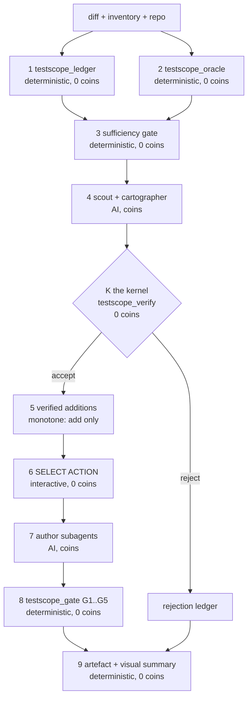

# TestScope — the test-code link ledger

> TestScope computes what a change did to your test suite, not just which tests to run —
> and every claim it makes is mechanically re-checked against your repository.

Given a diff, a test inventory and a repository, it answers **four** questions about every
test, because they are four cases of one relation (does a test link to changed code, and is
the changed contract preserved?):

| verdict | meaning | developer action |
|---|---|---|
| **must run** | the test links to changed code | run it; green means something |
| **STALE** | it asserts behaviour the change removed | fix or delete the *test*; do not bisect code |
| **NEWLY RELEVANT** | a hidden coupling nobody would have run | run it now; its green was false assurance |
| **UNCOVERED** | changed behaviour with no test at all | author a test (emitted as a work item) |

The visible optimisation (a large suite reduced by most of its size) is the demo. The product
is the two questions existing change-impact tools do not answer: **which of my tests are now
lying to me**, and **which of my new behaviours has no test**.

## The demo, measured

Target repository: `demo/`, a synthetic service with a **500-row** inventory. Change under
analysis: `diffs/change_b.patch` (revision A to revision B). All figures below come from
[`submissions/measurement.json`](submissions/measurement.json),
[`bob_session/testscope_report.json`](bob_session/testscope_report.json),
[`submissions/scorecard.json`](submissions/scorecard.json) and
[`VERIFICATION.md`](VERIFICATION.md).

| measurement | value | how it was produced |
|---|---|---|
| tests reduced | **48 of 500 (90.4% reduction)** | `python3 -m bob_session.pipeline.run_analysis` |
| structural + semantic | **41 + 7** | same artefact |
| executed ground truth | **3 discriminating tests** (one already-red test, zero flaky) | `python3 -m bob_session.oracle` |
| recall against that ground truth | **1.0** (missed: empty) | `python3 bob_session/measure.py` |
| price of safety | **7 tests** beyond the structural closure | same |
| stale tests found | **3** (they pass at both revisions: their green is false assurance) | same |
| uncovered behaviours found | **2** (one subsequently pinned by a gated test) | same |
| model layer ablation | **+1 true positive for 23 recorded coins** | `python3 bob_session/measure.py` |
| determinism | **8 runs, one digest** per configuration | `python3 bob_session/reliability_check.py` |
| the change's default test run | **green at both revisions** — the regression is invisible | `python3 -m pytest` in `demo/` |

The catch that motivates the design: revision B changes `cache_service.write_cache_entry` from
pipe-delimited text to `json.dumps`. `report_worker.parse_recent_cache_entries` still splits on
`"|"`, imports nothing from the cache service, and is absent from its import closure at every
depth. Under the repository's default marker set the suite is green at both revisions; under
`-m ""` the three contract tests pass at revision A and fail at revision B. Coverage and import
graphs cannot see it — that is not a missing feature, it is the wrong abstraction.

**Honest limits.** That ground truth is a lower bound: a test can be affected and still pass
twice, so over-selection is invisible to it. Recall is measured in one direction only, never
presented as precision, and never as a completeness guarantee — by Rice's theorem, "does this
change alter this test's behaviour" is undecidable, so no tool can guarantee completeness. What
is claimed instead is monotone soundness (the model layer can only add tests, never remove one)
and a recall number with its direction stated. Generated tests **PIN** behaviour (they will
detect future changes to it); they **SPECIFY** only when anchored to an intent artefact. Where
none exists we say "pinned", never "correct".

## Quick start

```bash
PYTHON=/path/to/python ./verify.sh     # regenerate every artefact, run every gate
```

Individually:

```bash
python3 -m bob_session.oracle                                   # executed ground truth
python3 -m bob_session.pipeline.run_analysis                    # the ledger artefact
python3 -m bob_session.gate                                     # G1..G5 on the authored test
python3 bob_session/measure.py                                  # submissions/measurement.json
python3 bob_session/reliability_check.py                        # the scorecard, each gate falsified
python3 -m pytest tests -q                                      # the engine's own suite
```

## Architecture: three strata, split at the decision boundary

```
 S SYMBOLIC   bob_session/pipeline     pure functions of (repo, diff, inventory); decides
                                       everything decidable. 0 model calls, 0 coins.
 K KERNEL     bob_session/verify.py    re-executes every obligation of S and of the model
                                       layer against the repository. Accept / reject /
                                       downgrade. THE TRUST BOUNDARY.
 I INFERENCE  bob_session/roles        four roles propose claims; their output is inert
                                       until K accepts it. Content-addressed cache.
```



Three of nine steps cost coins, and each is fed by a free step: deterministic steps consume no
model tokens, and anything that can be done deterministically is done deterministically.

**Determinism is proved by construction, not requested.** The artefact is
`f(inputs, K(P))` where `P` is content-addressed; `K` is total and deterministic and `f` is pure
(no clock, no RNG, total ordering). The scorecard gate R1 runs the ledger eight times per
configuration and observes one digest each, and reports the interesting case: with the proposal
cache warm versus cold and the model layer enabled, the accepted claim set differs — the cache
is doing the work, by design.

**Injection containment.** Because acceptance is mechanical, hostile prose in a repository
comment can at worst produce a false *proposal*, which the kernel rejects. Untrusted text cannot
cause an unsound accept.

## Repository layout

| path | what it is |
|---|---|
| `bob_session/pipeline/` | the symbolic stratum: diff parse, index, closure, coupling, dispositions, artefact |
| `bob_session/verify.py` | the kernel: citation resolution, re-derivation, safe direction |
| `bob_session/oracle.py` | dual-revision execution, completeness, flakiness, blindness |
| `bob_session/gate.py` | G1..G5: buildable, stable 5x, assertion fires at base, mutation strength, intent anchor |
| `bob_session/roles/` | the four role prompts, the recorded proposal set, the author's patch |
| `bob_session/mcp_server.py` | the four-tool MCP surface (STDIO JSON) |
| `.bob/`, `.bobrules/` | Bob-native configuration: MCP registration, custom mode, skill, rules |
| `demo/` | the target repository: a git history with revisions A, B, C, D and a 500-row inventory |
| `diffs/` | the change under analysis and three control diffs |
| `submissions/` | measurement, scorecard, ablation evidence, checklist, external sources |
| `schemas/` | the artefact JSON schema |

## Competitor comparison — including the columns where we do not win

| | selection | stale tests | uncovered behaviour | source of truth | explanation | measured recall | verified claims | deterministic |
|---|---|---|---|---|---|---|---|---|
| **Azure DevOps TIA** | yes (managed .NET only) | no | no | coverage | no | no | n/a | yes |
| **Datadog / CircleCI** | yes | no | no | coverage cross-reference to changed files | no | no | n/a | yes |
| **CloudBees Smart Tests / Launchable** | yes, up to ~80% reduction | no | **no** (their own documentation: TIA "only works with existing tests and can't predict impacts on tests that don't yet exist") | ML on past runs + file-level coverage | no | on their own benchmarks | n/a | partly |
| **LDRA TBevolve** | yes | partial | **yes — reports untested changed code** (we do not claim this column as unique) | deterministic, embedded-focused | no | no | n/a | yes |
| **Facebook predictive selection** | yes, ~99.9% of faults and ~95% of failing tests | no | no | statistical | **no** | no | n/a | partly |
| **Change Advisor (2026 tooling)** | partial | **yes, from a declared API schema** | no | declared schema | no | no | n/a | yes |
| **agentic testing products (2026)** | varies | varies | varies | usually none stated | varies | no | no | usually not |
| **TestScope** | yes | yes, derived from the **diff itself** | yes, as work items | the diff plus executed ground truth | yes, every verdict carries its evidence line | **yes, against executed ground truth, direction disclosed** | **yes: every claim re-derived by the kernel** | **yes, by construction (kernel + content-addressed cache)** |

What this table does **not** claim: that we are the first to detect untested changed code (LDRA
does it), that test selection is novel (it is a saturated market), that repairing stale tests is
novel (Change Advisor automates it from declared schemas — our difference is only the source of
truth: the diff, with no schema required), or that "using AI agents" is a differentiator. Agents
are table stakes; what is not is a kernel that re-derives every claim before it counts.

## Built versus specified

| capability | status |
|---|---|
| the ledger artefact: classification, four verdicts, uncovered work items, priority order | built (this repository, gated) |
| executed oracle with completeness, flakiness exclusion and blindness reporting | built |
| the kernel: citation resolution, re-derivation, rejection ledger, safe direction | built |
| G1..G5 for authored tests, with mutation strength restricted to the changed lines | built |
| measurement harness: recall, missed, price of safety, ablation | built |
| scorecard R1..R10, each gate falsified | built |
| Bob-native surface: `.bob/mcp.json`, custom mode, skill, rules, four-tool MCP server | built |
| live Bob IDE session and its session-summary screenshots | **not built — honest gap**, see `submissions/checklist.md` |
| incremental maintenance of the link relation across commits | specified, not built |
| coverage contexts as a second witness at scale | partially built (per-test contexts are captured; the kernel's witness prefers symbol references) |

## Reproducing every number

Every figure in this README appears in `submissions/measurement.json`,
`submissions/scorecard.json`, `VERIFICATION.md` or `submissions/external_sources.json`; the
no-unsourced-number gate R7 scans these documents and fails on any figure that is not. Figures
cited from outside this repository are registered with their source in
`submissions/external_sources.json`.

Provenance: `ARCHITECTURE_V2.md` is the normative design of record; `handoff/person_d.txt` is the
measurement workstream's assignment; both are kept in the repository for transparency.
